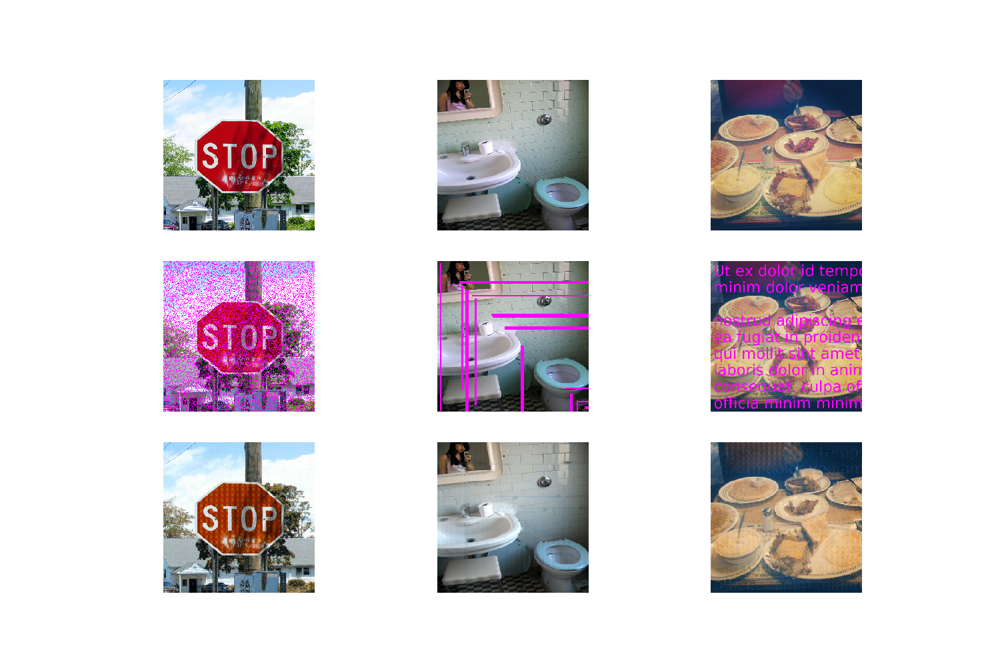
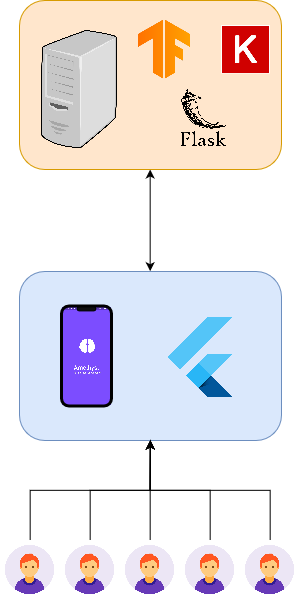
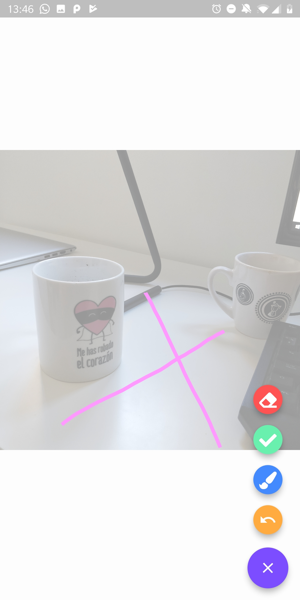

# Amethyst💎📸

This repo is the implementation of my project proposal for [Tensorflow 2.0 Challenge](https://tensorflow.devpost.com/).

## What is amethyst 🖼🎨

Amethyst is an intelligent photo editor which is capable to remove undesired parts of the images. To clean an image you just have to paint over the annoying item and Amethyst will automatically delete it for you!

Amethyst is an hybrid mobile application (works either on IOS or Android) developed using flutter.

Example:



## How it works? 🛠

Amethyst uses a complex GAN architecture to regenerate the drew part of the image. Because of the low compute power and the limited Amethyst uses the lightweight GAN described on this [paper](https://www.dropbox.com/s/e4l19y9ggqqk2yf/0360.pdf?dl=1).

The goal of this Neural Network is to complete the missing parts of the images based on the general context of the image.

To summarize the Amethyst AI is capable of removing corruption masks over an image using the generic context of the image.  

### Amethyst GAN 📙

The GAN which is goal is to complete missing parts of images is formed by:

- Generator: Recieves the corrupted image and removes the corruption. This generator is quite special and is composed of to parts
  - **Semantic Encoder**: Its goal is to generate a feature map capable of containing the most important images' features.
  - **Decoder**: Decodes the features generated with **Semantic Encoder** and generates the image without the corruption mask.

- **Discriminator**: NN to help during training, it differenciates between generated and original images without corruption mask. Helps on the backpropagation step influencing to the generator so it can creates more realistic images.

### Base papers for architecture

- **Generator**: The Semantic Encoder is based on (VERY DEEP CONVOLUTIONAL NETWORKS FOR LARGE-SCALE IMAGE RECOGNITION - VGG16)[https://arxiv.org/pdf/1409.1556.pdf] and the decoder is a simple stack of layers formed by convulutional, conv-transpose and elu activation.
- **Discriminator**: Based on [Context Encoders: Feature Learning by Inpainting](https://arxiv.org/pdf/1604.07379.pdf)

## Amethyst architecture 🏰



## Flutter Mobile App

### Splash Screen


### Image Selector

Select either from camera or gallery


### Image Editor

Draw over the unwanted part of the image to delete it

The editor provides diferent actions:
 
- Delete all the draw
- Undo a line
- Pick the brush thickness
- Done



## Image completition as a service

Perform a POST to `https://shrouded-refuge-72036.herokuapp.com/complete-image` with the following JSON body:

```JSON
{
    "img": "<image in base64>"
}
```

The response is the image completed in base64.